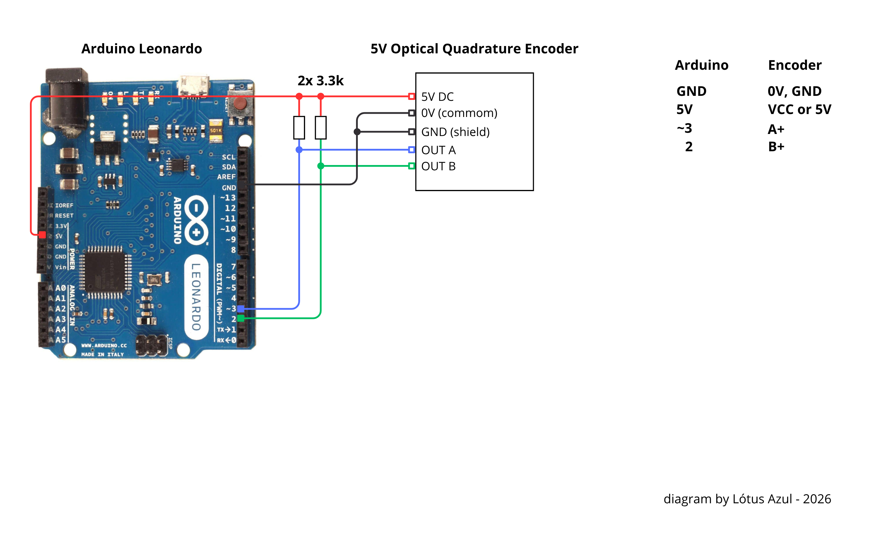
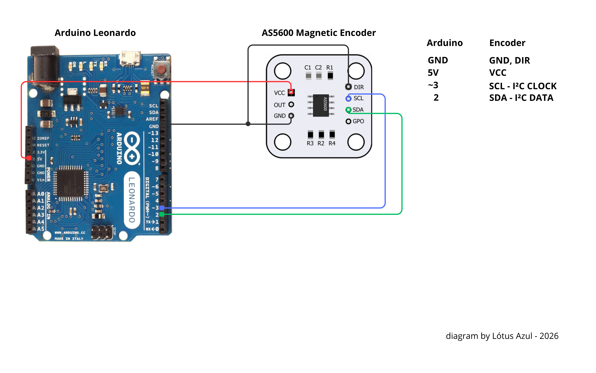
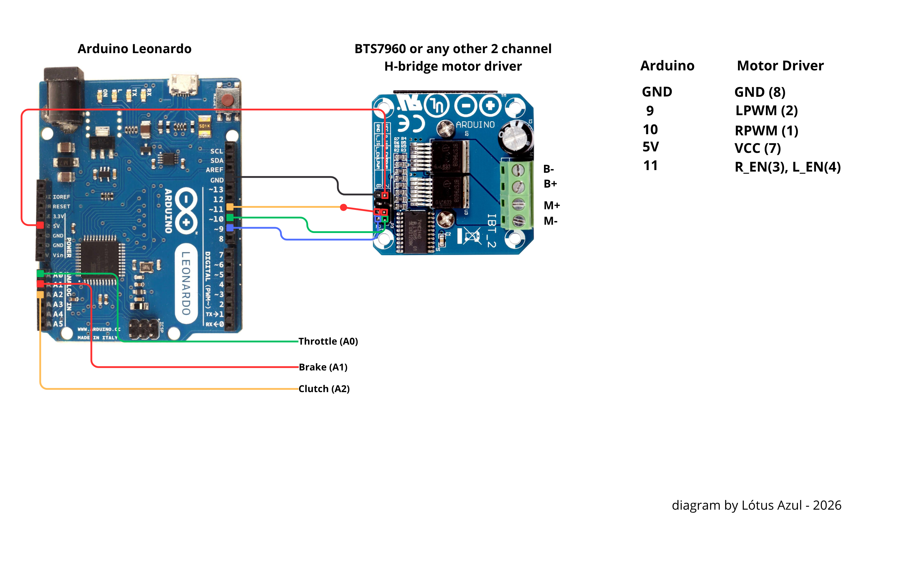
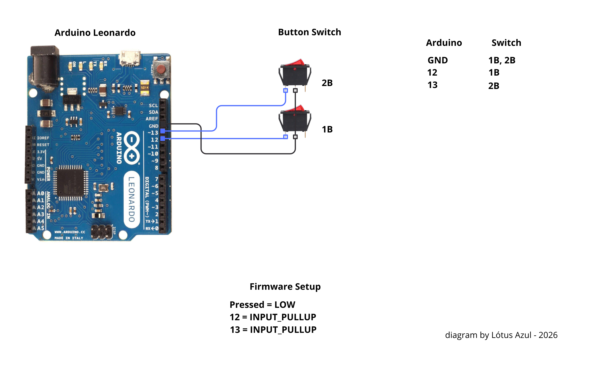

# BRSWDIY - Apus (Alpha)

**Brazil Steering Wheel DIY**

Lightweight and modular force feedback wheel project based on the Arduino Leonardo, designed to run with low overhead and without requiring the desktop app during gameplay.

Projeto de volante com force feedback leve e modular baseado em Arduino Leonardo, projetado para funcionar com baixo overhead e sem depender da GUI durante o uso.

## PT-BR

### Visao geral

O **BRSWDIY** e um projeto de volante DIY com force feedback focado em:

- firmware leve e eficiente
- arquitetura simples e modular
- uso plug-and-play
- configuracao opcional por software

Esta versao alfa se chama **Apus**. O nome faz parte do versionamento para projetos alternativos, baseado em constelacoes.

### Objetivos do projeto

- funcionar sem depender da GUI aberta
- manter bom desempenho no Arduino Leonardo
- oferecer configuracao via protocolo serial e utilitario proprio
- permitir evolucao futura sem reescrever toda a base

### Como o projeto esta organizado

- [`firmware/`](firmware/) - firmware do volante
- [`software/`](software/) - GUI `Apus Utility`
- [`hardware/`](hardware/) - diagramas e referencias de montagem

### Diagramas da versao Apus

- Encoder incremental (Versao Apus Icremental Raw/Dir): 
- Encoder magnetico (Versao Apus Magnetic Raw/Dir): 
- Motor driver e pedais: 
- Paddle buttons com `GND + INPUT_PULLUP`: 

### Variantes de firmware

Atualmente o projeto possui quatro variantes de firmware:

- `Raw Incremental`
- `Dir Incremental`
- `Raw Magnetic`
- `Dir Magnetic`

#### Raw

Versao com resposta mais bruta e mais direta, preservando o maximo possivel da sensacao vinda do jogo. E indicada para quem prefere sentir mais textura, vibracao e agressividade no volante, recomendado para uso em cockpit.

#### Dir

Versao mais refinada, com uso de `direction` para polir parte da forca e reduzir ruidos desnecessarios. E voltada para quem prefere uma experiencia mais suave e controlada sem perder fidelidade.

#### Incremental

Voltada para encoders incrementais em quadratura.

#### Magnetic

Voltada para AS5600 via `I2C`.

### Caracteristicas principais

- firmware otimizado para Arduino Leonardo
- dispositivo HID com force feedback
- configuracao persistente em EEPROM
- GUI opcional para calibracao e ajustes
- suporte a filtros como `gain`, `damper`, `friction`, `inertia` e `spring`
- suporte a multiplas variantes de encoder e firmware

### Status

> **Alpha - Apus**

O projeto ja possui:

- FFB funcional
- protocolo serial estavel
- GUI funcional
- builds separadas por variante
- release em `.hex` para firmware e `.exe` para software

Ainda e uma versao alfa e pode receber refinamentos adicionais.

### Pacote de distribuicao

O pacote `.zip` de release e organizado em tres pastas:

- `Xload/`
  Contem a aplicacao do **XLoader**, usada para gravar o firmware `.hex` na placa.

- `Firmware/`
  Contem as quatro variantes do firmware em `.hex`.

- `Software/`
  Contem o executavel `.exe` da GUI **Apus Utility**.

### Como usar o pacote `.zip`

#### 1. Instalar o firmware

1. Conecte a Arduino Leonardo ao PC.
2. Abra o **XLoader** dentro da pasta `Xload/`.
3. Escolha o arquivo `.hex` desejado dentro da pasta `Firmware/`.
4. Selecione a placa e a porta corretas.
5. Grave o firmware.

#### 2. Usar a GUI

1. Abra a pasta `Software/`.
2. Execute o `.exe` do **Apus Utility**.
3. Conecte ao volante.
4. Ajuste filtros, calibracao e limites conforme necessario.

### Desenvolvimento

Para instrucoes detalhadas de build e desenvolvimento:

- veja [`firmware/README.md`](firmware/README.md)
- veja [`software/README.md`](software/README.md)

### Creditos

Este projeto existe gracas ao trabalho de base de:

- Peter Barrett - HID and USB core for Arduino
- ranenbg - [Arduino-FFB-wheel](https://github.com/ranenbg/Arduino-FFB-wheel)

Muito obrigado por tornarem esse tipo de projeto possivel.

## EN

### Overview

**BRSWDIY** is a DIY force feedback wheel project focused on:

- lightweight and efficient firmware
- a clean modular architecture
- plug-and-play usage
- optional desktop configuration

This alpha version is called **Apus**. The name is part of the versioning for alternative projects, based on constellations.

### Project goals

- work without requiring the GUI to stay open
- keep stable performance on the Arduino Leonardo
- provide configuration through a serial protocol and a dedicated utility
- allow future evolution without rewriting the whole base

### Repository layout

- [`firmware/`](firmware/) - wheel firmware
- [`software/`](software/) - `Apus Utility` desktop app
- [`hardware/`](hardware/) - wiring diagrams and hardware references

### Apus hardware diagrams

- Incremental encoder: 
- Magnetic encoder: 
- Motor driver and pedals: 
- Paddle buttons using `GND + INPUT_PULLUP`: 

### Firmware variants

The project currently ships four firmware variants:

- `Raw Incremental`
- `Dir Incremental`
- `Raw Magnetic`
- `Dir Magnetic`

#### Raw

A more visceral and direct version that preserves as much track texture and game force as possible. Recommended for users who want a more aggressive steering feel. Recommended for use in cockpit simulators!!

#### Dir

A more refined version that uses `direction` to smooth unwanted force noise while keeping a strong and responsive feel.

#### Incremental

Designed for quadrature incremental encoders.

#### Magnetic

Designed for AS5600 over `I2C`.

### Main features

- optimized firmware for Arduino Leonardo
- HID force feedback device
- persistent EEPROM configuration
- optional GUI for calibration and tuning
- support for filters such as `gain`, `damper`, `friction`, `inertia`, and `spring`
- multiple encoder and firmware variants

### Status

> **Alpha - Apus**

The project already includes:

- working FFB
- stable serial protocol
- working GUI
- separate builds per variant
- release artifacts in `.hex` for firmware and `.exe` for software

It is still an alpha release and may receive additional refinement.

### Distribution package

The release `.zip` package is organized into three folders:

- `Xload/`
  Contains the **XLoader** application used to flash the `.hex` firmware to the board.

- `Firmware/`
  Contains the four firmware variants as `.hex` files.

- `Software/`
  Contains the `.exe` build of the **Apus Utility** GUI.

### How to use the `.zip` package

#### 1. Flash the firmware

1. Connect the Arduino Leonardo to the PC.
2. Open **XLoader** from the `Xload/` folder.
3. Choose the desired `.hex` file from the `Firmware/` folder.
4. Select the correct board and serial port.
5. Flash the firmware.

#### 2. Use the GUI

1. Open the `Software/` folder.
2. Run the **Apus Utility** `.exe`.
3. Connect to the wheel.
4. Adjust filters, calibration, and limits as needed.

### Development

For detailed development and build instructions:

- see [`firmware/README.md`](firmware/README.md)
- see [`software/README.md`](software/README.md)

### Credits

This project builds on the work of:

- Peter Barrett - HID and USB core for Arduino
- ranenbg - [Arduino-FFB-wheel](https://github.com/ranenbg/Arduino-FFB-wheel)

Thank you for making projects like this possible.
